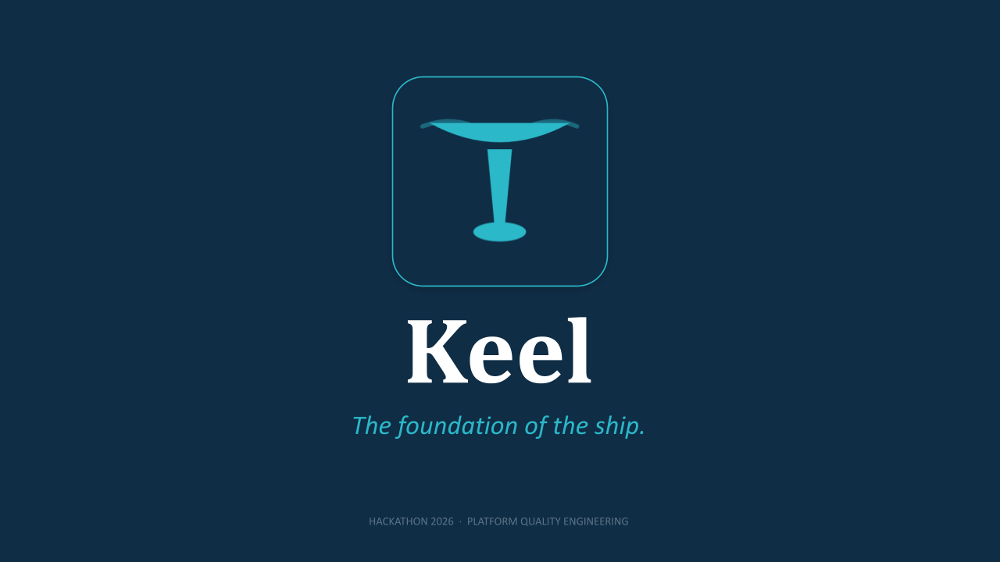
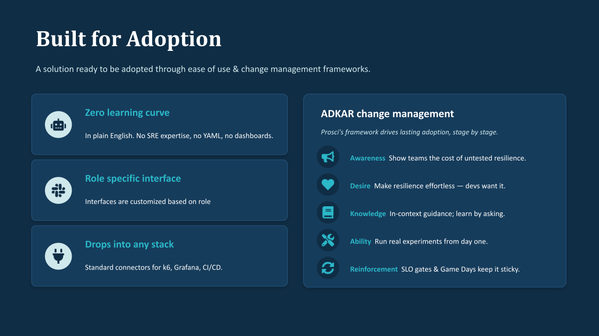
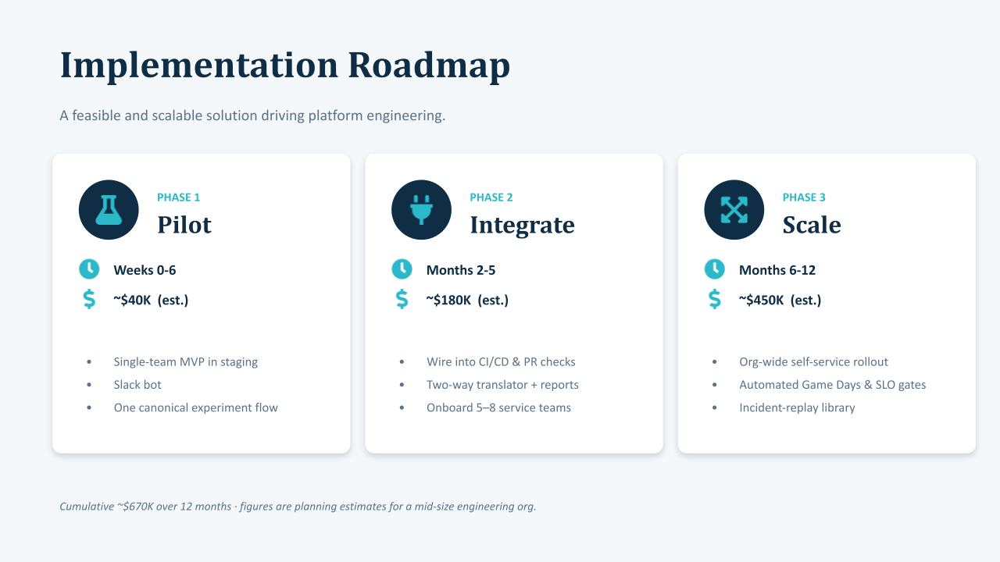

  

<h1 align="center">Keel</h1>

<em>The foundation of the ship. Resilience you can talk to.</em>

  <strong>An interactive SRE and chaos engineering co-pilot, powered by Gemini, that lets an entire product team simulate, diagnose, and remediate incidents through plain conversation.</strong>

  🎬 <a href="https://youtu.be/IQ1bTmSWtZ8"><strong>Watch the 2 minute demo video</strong></a>
  &nbsp;·&nbsp;
  📊 <a href="presentation/keel-pitch-deck.pdf"><strong>Pitch deck (PDF)</strong></a>

---

## Project Title
**Keel: an SRE and chaos engineering co-pilot for the whole team.**

## Participants
Team **TELUS GTLP**
* Ben Hilderman
* Anjuthan Tharmarajah
* Ansia Sivakumaran
* Nolan Verboomen

## Problem Statement
Resilience knowledge lives with a handful of SREs and senior engineers. Everyone else on a product team, including product managers, designers, executives, and non technical stakeholders, struggles to answer simple questions: Will checkout survive a peak sale? What does an hour of downtime cost us? Is this slow for users? Running a real fault simulation or reading a chaos report is out of reach for most of the team. The result is slow feedback, shallow shared understanding of risk, and reliability work that never quite gets prioritized.

## Solution Summary
Keel turns resilience engineering into a conversation. Anyone can ask a high level question in plain English, and Keel translates it into active cluster queries and stress tests, then explains the outcome in language that fits the person asking.

The core innovation is **operational profile gating**: a single conversational engine that adapts its telemetry, vocabulary, and recommendations to the user's role. The same incident is reframed automatically for a developer, a product manager, a designer, an executive, or a non technical stakeholder, so the whole team builds shared understanding from one source of truth.

## Target Users
Whole product teams with mixed technical depth.

| Role | What Keel surfaces |
| :--- | :--- |
| 💻 Developer | Architectural diagnostics, connection pool status, YAML validation, `p95` latency trends |
| 💼 Product Manager | Cart abandonment, checkout friction, retention funnel drop off |
| 🎨 Designer | Interaction delay (FID), Cumulative Layout Shift (CLS), loader fallback states |
| 🧭 Executive | SLA budgets, hourly downtime cost, outage recovery exposure |
| 👤 Non Technical | Plain English speed and uptime indicators, safety guarantees |

## Tech Stack
* **Frontend:** React 19 and TypeScript
* **Build tool:** Vite 6
* **Server:** Express full stack, run with `tsx` in development
* **AI:** Google Gemini through `@google/genai`, called server side
* **Styling:** Tailwind CSS v4
* **Animation:** Motion
* **Icons:** Lucide React
* **Production bundler:** esbuild, compiling the server to a standalone CommonJS bundle for fast container cold starts

## Architecture Overview
A single Express server hosts both the API and the Vite built React frontend. In development, Vite runs as Express middleware for instant hot reload. In production, esbuild bundles `server.ts` into `dist/server.cjs` and serves the static frontend assets. All Gemini calls happen server side, so the API key never reaches the browser. The interface is a split view workspace: a conversational panel on the left, and a live role dependent telemetry control board on the right.

## Repository Structure
* `src/` contains the complete, runnable Keel application.
  * `src/src/App.tsx` is the primary hub for profile gating, chat panels, and workflows.
  * `src/src/components/RoleDashboard.tsx` renders the role specific telemetry dashboards, including SVG charts, gauges, and KPIs.
  * `src/src/components/ExperimentPlanCard.tsx` shows active test blueprints and step by step progress.
  * `src/src/components/ProvisioningPanel.tsx` handles virtual cluster configuration and resource state.
  * `src/server.ts` is the full stack Express server with Vite middleware and static routes.
  * `src/.env.example` is the template for required secrets such as `GEMINI_API_KEY`.
* `presentation/` contains the pitch deck, demo video link, and slide images.
* `docs/` contains supporting notes.

## Setup Instructions
> Requires Node.js 18 or newer.

1. `cd src`
2. `npm install`
3. Copy `.env.example` to `.env` and set `GEMINI_API_KEY` to a valid Google Gemini API key.

## Run Instructions
1. Development: `npm run dev`, which serves the full stack app on port `3000`.
2. Production build: `npm run build`, which builds the frontend and bundles the server to `dist/server.cjs`.
3. Production start: `npm run start`.
4. Type check: `npm run lint`, which runs `tsc --noEmit`.

> Validated on a clean install: `npm install` (214 packages) and `npm run lint` both pass.

## Demo Instructions
1. Start the app with `npm run dev` and open http://localhost:3000.
2. Select an operational profile, for example Developer or Executive.
3. Watch the right hand telemetry board populate with role specific live metrics.
4. Use the conversational panel to trigger an investigation, for example "simulate a database slowdown during a peak sale" or "blast synthetic traffic at the checkout endpoint."
5. Switch profiles to see the same incident reframed for a different audience.

## Presentation

**🎬 Demo video:** [Watch the demo on YouTube](https://youtu.be/IQ1bTmSWtZ8)

**📊 Pitch deck:** [keel-pitch-deck.pdf](presentation/keel-pitch-deck.pdf)

### Built for Adoption
Keel is designed to be adopted, not just demoed. It has a zero learning curve, a role specific interface, and standard connectors for k6, Grafana, and CI/CD. Rollout follows the Prosci ADKAR change management framework so adoption sticks.

### Implementation Roadmap
A feasible, phased rollout for a mid size engineering organization.

| Phase | Timeline | Estimate | Highlights |
| :--- | :--- | :--- | :--- |
| **1. Pilot** | Weeks 0 to 6 | ~$40K | Single team MVP in staging, Slack bot, one canonical experiment flow |
| **2. Integrate** | Months 2 to 5 | ~$180K | Wire into CI/CD and PR checks, two way translator and reports, onboard 5 to 8 service teams |
| **3. Scale** | Months 6 to 12 | ~$450K | Org wide self service rollout, automated Game Days and SLO gates, incident replay library |

Cumulative investment is roughly $670K over 12 months. Figures are planning estimates.

## Known Limitations
* Requires a valid `GEMINI_API_KEY`. Without it, the conversational features do not function.
* Telemetry, simulations, and cluster state are simulated for demonstration purposes.
* Voice input depends on browser and microphone permissions.

## License
No separate license is specified for this submission. Third party libraries retain their respective licenses, including React, Vite, Express, Tailwind CSS, Motion, Lucide, and `@google/genai`.
